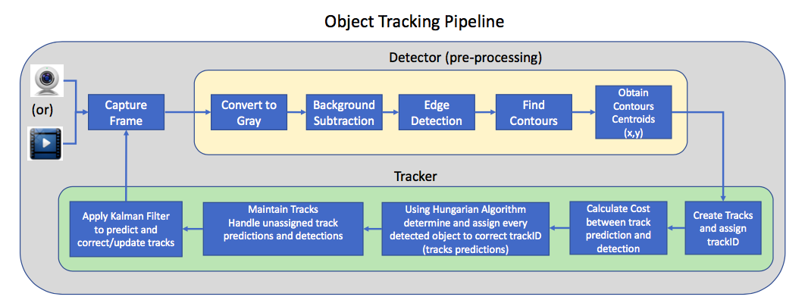
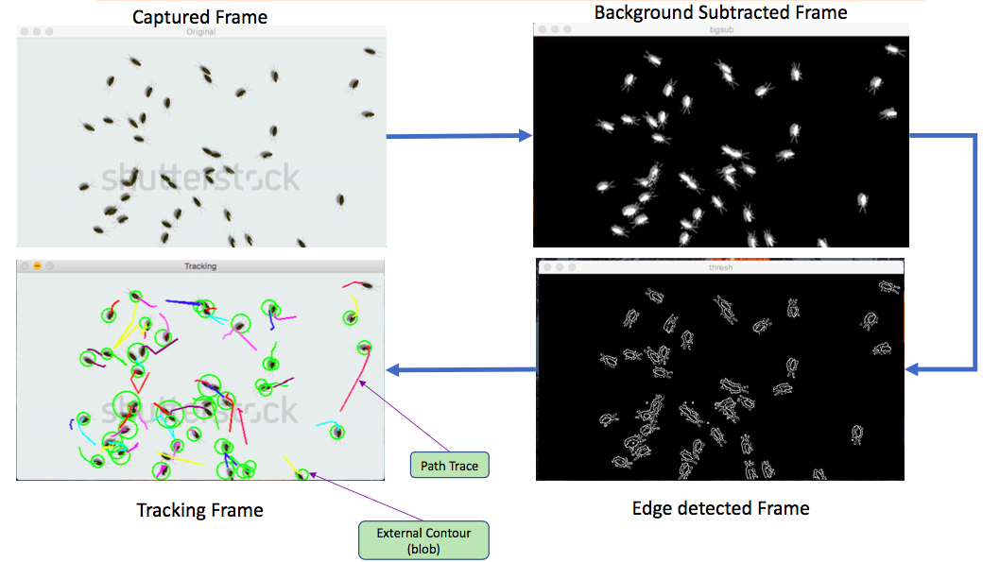

Multi Object Tracker Using Kalman Filter & Hungarian Algorithm
----
- Author: Srini Ananthakrishnan  
- Project: DSCI-6008 Final Project
- Date: 07/14/2017

- Usage:  
$ python2.7 objectTracking.py  

- Design:  

  

- Output:  

  

- Pre-requisite:  
    - Python2.7  
    - Numpy  
    - SciPy  
    - Opencv 3.0 for Python - [Installation](http://www.pyimagesearch.com/2015/06/15/install-opencv-3-0-and-python-2-7-on-osx/)
    
- References:    
  - [Excellent MATLAB tutorial by Student Dave on object tracking](http://studentdavestutorials.weebly.com/multi-bugobject-tracking.html)   
  - [OpenCV Tutorial: Multiple Object Tracking in Real Time by Kyle Hounslow](https://www.youtube.com/watch?annotation_id=annotation_307976421&feature=iv&src_vid=RS_uQGOQIdg&v=bSeFrPrqZ2A)  
    
